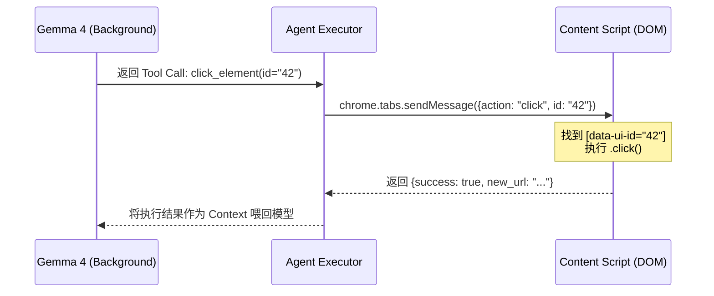

# 🚀 突破浏览器插件：如何解决 Gemma 4 在 DOM 交互中的“定位准度”困境？

随着 **Gemma 4** 在 2026 年初的发布，其在端侧机器上的推理性能已经足以支撑复杂的浏览器自动化任务。许多开发者（包括我自己）开始尝试将 Gemma 4 塞进 Chrome 插件，试图打造一个“真正懂网页”的个人助理。

然而，理想很丰满，现实很骨感。在实测过程中，我们经常会遇到：
- **“幻觉定位”**：Gemma 给出了一个看起来很完美的 CSS Selector，但 `querySelector` 返回 `null`。
- **“目标偏移”**：模型试图点击“提交”按钮，结果却点到了旁边的“取消”。
- **“DOM 爆炸”**：现代单页应用（SPA）动辄几千个 DOM 节点，直接把 Gemma 的上下文窗口撑爆或者让它在噪音中迷失。

今天，我们就来深度聊聊如何解决 Gemma 4 与 DOM 交互时的“精准定位”问题。

---

## 🧐 为什么 Gemma 4 会“迷失”在网页里？

即便 Gemma 4 拥有极强的逻辑推理能力，它本质上仍然是在处理**文本序列**。而现代 DOM 对 AI 并不友好：
1.  **类名污染**：Tailwind 或 CSS Modules 生成的 `class="flex mt-4 h-10 w-24..."` 对模型来说几乎没有任何语义信息。
2.  **结构深邃**：为了实现一个居中效果，前端可能嵌套了 5 层 `div`，路径长度超出了模型的注意力焦点。
3.  **动态变化**：ID 可能是动态生成的，每次刷新页面都在变。

---

## 🛠️ 三步走方案：让定位像“狙击”一样精准

### 第一阶段：语义蒸馏 (Semantic Distillation)

**不要把 HTML 直接丢给模型。** 我们需要一个中间层，也就是“语义树”。

> [!TIP]
> 过滤所有非交互元素（如空的 `div`, `span`, `br`），只保留 `button`, `input`, `a` 以及带有 `click` 事件监听器的元素。

**优化方案：**
为每个候选元素打上一个临时的 `data-agent-id`。
```javascript
// 在 content script 中预处理
const interactiveElements = document.querySelectorAll('button, input, a, [role="button"]');
interactiveElements.forEach((el, index) => {
  el.setAttribute('data-ui-id', index);
});

// 只同步关键信息给 Gemma
const simplifiedDOM = Array.from(interactiveElements).map(el => ({
  id: el.getAttribute('data-ui-id'),
  tag: el.tagName,
  text: el.innerText || el.placeholder || el.ariaLabel,
  type: el.type
}));
```

### 第二阶段：空间感知增强 (Spatial Encoding)

LLM 默认是没有“视觉”的，它不知道元素在屏幕的哪个位置。我们需要赋予它**坐标感**。

在给 Gemma 4 的 Prompt 中，不仅提供 ID 和标签，还要提供 **Bounding Box**：
```json
{
  "id": "42",
  "tag": "BUTTON",
  "label": "立即购买",
  "rect": {"x": 120, "y": 450, "width": 100, "height": 40}
}
```
通过引入相对坐标（Viewport-relative coordinates），Gemma 4 可以更好地理解元素之间的层级和遮挡关系，显著降低“点错”的概率。

### 第三阶段：闭环验证循环 (The Verification Loop)

**“信任，但要核实”。** 当 Gemma 4 决定执行一个动作（如 `click`）时，插件不应立即执行，而是进入验证阶段。

1.  **Selector 预检**：如果模型生成的 Selector 匹配到多个元素，返回错误让它重新生成更具体的路径。
2.  **状态对比**：点击前记录快照，点击后 500ms 检查 DOM 是否发生变化。如果没有，说明定位可能失效，触发重试。

---

## 💡 实战技巧：针对 Gemma 4 的 Prompt 优化

在 2026 年，针对小参数量但高智商的模型，**强约束 XML 格式**比纯 JSON 效果更好：

```xml
<system_instruction>
你是一个网页自动化专家。
在定位元素时，优先使用 data-ui-id 执行操作。
如果发现页面存在 Shadow DOM，请务必使用特殊的路径语法。
</system_instruction>

<current_task>
在当前页面找到搜索框并输入“Gemma 4 教程”。
</current_task>

<page_fragment>
  <element id="12" tag="INPUT" placeholder="搜索..." />
  <element id="13" tag="BUTTON" label="搜索" />
</page_fragment>
```

---

## 🛠️ 深度进阶：如何设计“懂 DOM”的工具集？

除了定位，最让开发者头疼的是 **Tool Use (函数调用)** 的设计。Gemma 4 支持工具调用，但如果工具定义得太模糊，模型就会乱用。

### 1. 原子化工具设计 (Atomic Tools)

不要给模型一个 `automate_login` 这样庞大的工具，而是给它一系列原子化的指令。

| 工具名称 | 参数 | 职责 |
| :--- | :--- | :--- |
| `click_element` | `element_id` | 点击指定的 `data-ui-id`。 |
| `type_text` | `element_id`, `text` | 在输入框输入文本。 |
| `scroll_to` | `element_id` | 将元素滚动到视口中央（提高定位成功率）。 |
| `wait_for_navigation` | - | 等待页面跳转或异步加载完成。 |

### 2. 桥接架构：从模型思维到 DOM 执行

在浏览器插件中，模型运行在 `background` 或 `sidepanel`，而 DOM 在 `content script`。你需要构建一个稳健的通信链路：



### 3. 处理“幽灵元素” (Shadow DOM & Iframes)

这是很多工具执行失败的重灾区。你的定位工具需要具备**递归穿透**能力：

```javascript
// 一个能够穿透 Shadow DOM 的定位辅助函数
function findElementInComposedPath(id) {
  const allElements = document.querySelectorAll('*'); // 初始简化，实际开发建议用 TreeWalker
  for (let el of allElements) {
    if (el.getAttribute('data-ui-id') === id) return el;
    // 递归检查 shadowRoot
    if (el.shadowRoot) {
      const found = el.shadowRoot.querySelector(`[data-ui-id="${id}"]`);
      if (found) return found;
    }
  }
}
```

---

## 🚀 总结

解决 Gemma 4 浏览器插件定位问题的核心，不在于“让模型变大”，而在于**“让环境变清晰”**。通过语义蒸馏、坐标注入和闭环验证，我们可以将定位准确率从 60% 提升到 95% 以上。

如果你正在开发基于浏览器的 AI Agent，记住一句话：**给模型喂“信息”，而不是喂“源代码”。**

---

> [!IMPORTANT]
> **下一步推荐阅读**：
> - [Agent 如何处理 Shadow DOM 的穿透问题？](./agent-shadow-dom.md)
> - [利用 WebGPU 加速 Gemma 4 插件的响应速度](./webgpu-gemma-speedup.md)

> **系列标签**：#BrowserExtension #Gemma4 #LLM #Automation
